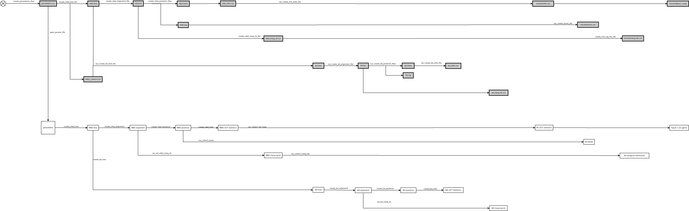

# razzo

## Folder structure

In `razzo_project`, there is a folder called `data`.
In `data`, there are folders named after their parameters, e.g. `0.2-0.15-1-0.1`.
In each of these folders, there are folders named after their seeds, e.g. `1`.
In each of these folders, there are folders named after their site and clock models, e.g. `strict-jc69`.

In each of these folders, there are:

Filename|Description|Created by
-------------|---------------------------------------|--------------------------
`parameters.csv`|the parameter file|`raz_create_parameter_files`
`mbd.tree`|the true MBD tree|`raz_create_mbd_tree_file`
`mbd.fasta`|the true MBD alignment|`raz_create_mbd_alignment_file`
`bd.tree`|the twin BD tree|`raz_create_bd_tree_file`
`bd.fasta`|the twin BD alignment|`raz_create_bd_alignment_file`
`mbd.trees`|the posterior trees from `mbd.tree`|`raz_create_mbd_posterior_files`
`mbd.log`|the posterior parameter estimates from `mbd.tree`|`raz_create_mbd_posterior_files`
`mbd_mar_lik.csv`|the posterior's marginal likelihood from `mbd.tree`|`raz_create_mbd_posterior_files`
`bd.trees`|the posterior trees from `bd.tree`|`raz_create_bd_posterior_files`
`bd.log`|the posterior parameter estimates from `bd.tree`|`raz_create_bd_posterior_files`
`bd_mar_lik.csv`|the posterior's marginal likelihood from `bd.tree`|`raz_create_mb_posterior_files`
`mbd_nltts.csv`|the nLTT statistic distribution between `mbd.tree` and `mbd.trees`|`raz_create_mbd_nltt_file`
`bd_nltts.csv`|the nLTT statistic distribution between `bd.tree` and `bd.trees`|`raz_create_bd_nltt_file`

See [a razzo_project build log](https://travis-ci.org/richelbilderbeek/razzo_project/jobs/457099656#L1789)
to see such a `data` folder.

## Function overview

 * Data creation: produces parameter files and output
 * Results creation: creates figures and tables from the data

### Data creation

Produces parameter files and output

#### File handling functions

All functions that end with `_file` or `_files`.
These functions are friendly to scripted use and
require only filenames as arguments.

Status|Description|Function name
---|---|---
Done|Done|Create parameter files|`raz_create_parameters_files`
Done|Create MBD tree file|`raz_create_mbd_tree_file`
Done|Create MBD alignment file|`raz_create_mbd_alignment_file`
Done|Create twin BD tree file|`raz_create_bd_tree_file`
Done|Create twin BD alignment file|`raz_create_bd_alignment_file`
Done|Create MBD posterior files|`raz_create_mbd_posterior_files`
Done|Create twin BD posterior files|`raz_create_bd_posterior_files`
Done|Create MBD nLTT file|`raz_create_mbd_nltt_file`
Done|Create twin BD nLTT file|`raz_create_bd_nltt_file`
.   |Create MBD marginal likelihood estimation files|`raz_create_mbd_marg_lik_files`
.   |Create twin BD marginal likelihood estimation files|`raz_create_bd_marg_lik_files`

#### Data handling functions

These functions do the actual work. 
They work on parsed data and are not intended to be called from a script

Status|Description|Function name
---|---|---
Done|Create parameter|`raz_create_parameters`
Done|Create MBD tree|`raz_create_mbd_tree`
Done|Create BD tree|`raz_create_bd_tree`
Done|Create MBD alignment|`raz_create_mbd_alignment`
Done|Create BD alignment|`raz_create_bd_alignment`
Done|Create MBD posterior|`raz_mbd_create_posterior`
Done|Create BD posterior|`raz_bd_create_posterior`
Done|Create MBD nLTT|`raz_create_mbd_nltt`
Done|Create BD nLTT|`raz_create_bd_nltt`
.   |Estimate MBD marginal likelihood|`raz_est_mbd_marg_lik`
.   |Estimate BD marginal likelihood|`raz_est_bd_marg_lik`

### Results creation

Creates figures and tables from the data.

#### Data handling

All these functions take the project folder's name as an argument
and return a tidy data frame or figure.
They are not intended to be called from a script

Status|Description|Function name
---|---|---
Issue|Collect marginal likelihoods|`raz_collect_marg_log_liks`
Issue|Collect effective sample sizes|`raz_collect_esses`
Issue|Collect nLTT statistics|`raz_collect_nltt_stats`
Issue|Create figure 1|`raz_create_fig_1`

#### File handling

All functions that end with `_file` or `_files`.
These functions are friendly to scripted use and
require only the project folder's name as an argument.

Status|Description|Function name
---|---|---
Issue|Collect marginal likelihoods|`raz_create_mar_log_liks_file`
Issue|Collect effective sample sizes|`raz_create_esses_file`
Issue|Create nLTT statistics file|`raz_create_nltt_stats_file`
Issue|Create figure 1|`raz_create_fig_1_file`
