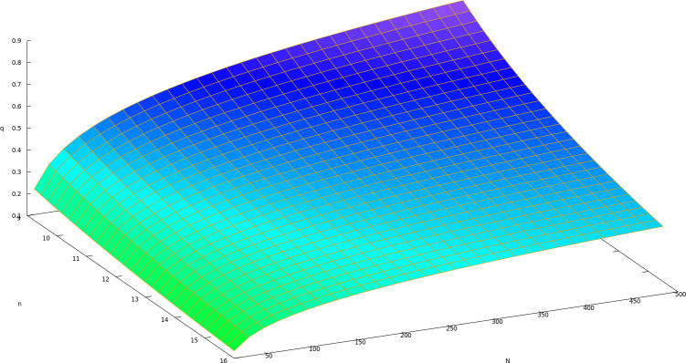

```{r setup, include = FALSE}
knitr::opts_chunk$set(
  collapse = TRUE,
  comment = "#>"
)
```

# Goal

From

 * a desired number of extant taxa ($n$)
 * a desired fraction of taxa that goes extinct ($f_{\dagger}$)
 * a desired fraction of taxa formed by the MB process ($f_{\mathbb{M}}$)
 * a desired MB regime ($n_{\nu}$)

To derive the MBD parameters

 * speciation rate $\lambda$
 * extinction rate $\mu$
 * rate at which a co-occuring speciation event in triggered $\nu$
 * fraction of species that speciate 
   during such a co-occurring speciation event $q$

## Overview

 * Symbols
 * Setup
 1. number of extant taxa
 2. fraction of the taxa extinct
 3. fraction of the taxa created by the MB process
 4. MB regimes: calculate $q$
 5. fraction of the taxa created by the BD process
 * Further derivation of the MBD parameters
 6. speciation rate $\lambda$
 7. number of extinct taxa
 8. extinction rate $\mu$
 9. calculating $\nu$
 * Conclusion
 * Data verification

## Symbols

Symbol|Code|Description
---|--------------|-------------------------------------------------------------
$n$|`n_taxa`|Number of extant and extinct taxa
$N$|`n_extant_taxa`|Number of extant taxa
$f_{\star}$|`f_extant`|Fraction of taxa that survives and remains extant
$f_{\dagger}$|`f_extinct`|Fraction of taxa that goes extinct
$f_{\mathbb{M}}$|`f_mb`|Fraction of extinct and extant taxa formed by the MB process
$f_{\mathbb{B}}$|`f_bd`|Fraction of extinct and extant taxa formed by the single-birth process
$N_{\mathbb{M}}$|`n_mb_taxa`|Number of extant and extinct taxa formed by the MB process
$N_{\mathbb{B}}$|`n_bd_taxa`|Number of extant and extinct taxa formed by the single-birth process
$n_{\mathbb{M}}$|`n_extant_mb_taxa`|Number of extant taxa formed by the MB process
$q$|`q`|Fraction of taxa that speciate during a triggered co-occuring speciation event
$\nu$|`nu`|Rate at which co-occurent speciation events are triggered
$n_{\nu}$|`n_nu_events`|Number of triggered co-occurent speciation events
$\lambda$|`lambda`|Per-lineage (single-birth) speciation rate
$\mu$|`mu`|Per-lineage extinction rate
$T$|`crown_age`|Crown age

## Setup

```{r}
library(ggplot2)
```

```{r}
crown_age <- 15
```

## 1. number of extant taxa

From the biological parameters derived here,
we will simulate phylogenies and only keep those
with the desired number of extant taxa $n$.

```{r}
n_extant_taxas <- c(60, 120, 240)
```

These are values close to 50, 100, 200,
yet these play better with the next sections,
in which the fractions of extinction $f_{\dagger}$ and
MB-generated taxa $f_{\mathbb{M}}$ are chosen.

## 2. fraction of the taxa extinct

We pick a desired strength of extinction.
Instead of using an extinction rate,
we use a fraction of the taxa that went extinct 
before the reaching the present $f_{\dagger}$.

```{r}
f_exinctses <- c(0.0, 0.25, 0.5) # Gollumese plural
```

Now we can derive the total number of (extant and extinct) taxa $N$,
using survival fraction $f_{\star}$:

$$
f_{\star} = 1 - f_{\dagger}
$$

$$
n = N f_{\star}
$$

$$
N = \frac{n}{f_{\star}} = \frac{n}{1 - f_{\dagger}}
$$

```{r}
df <- expand.grid(n_extant_taxa = n_extant_taxas, f_extinct = f_exinctses)
df$n_taxa <- df$n_extant_taxa / (1.0 - df$f_extinct)
df$n_extinct_taxa <- df$n_taxa - df$n_extant_taxa
knitr::kable(head(df))
```

## 3. fraction of the taxa created by the MB process

We pick a desired strength of MB-ness.
To do so, we set a desired fraction of taxa created by the MB process $f_{\mathbb{M}}$.

```{r}
f_mbs <- c(0.0, 0.25, 0.50, 0.75, 1.0)
```

As we know the number of (extinct and extant) taxa $N$, we can calculate this:

```{r}
df <- expand.grid(
  n_extant_taxa = n_extant_taxas,
  f_extinct = f_exinctses,
  f_mb = f_mbs
)
df$n_taxa <- df$n_extant_taxa / (1.0 - df$f_extinct)
df$n_mb_taxa <- df$f_mb * df$n_taxa
knitr::kable(head(df))
```

## 4. MB regimes: calculate $q$

We pick a desired MB regime.
There are three MB regimes, in which the co-occuring speciation events are:


 * few events of strong intensity
 * some events of intermediate intensity
 * many events of modest intensity

Starting from two lineages and $q = 1$, the number
of (extant and extinct) lineages $N$ will be

$$
N = 2^{n_{\nu}}
$$

As we know the highest number of taxa $N$ we need:

```{r}
max_n <- max(df$n_mb_taxa)
print(max_n)
```

We can calculate the minimal number of events we need, rounded up to
the nearest integer:

$$
N = 2^{n_{\nu}}
$$

$$
n_{\nu} = \left \lceil{\frac{log(N)}{log(2)}}\right \rceil
$$

```{r}
min_n_events <- ceiling(log(max_n) / log(2))
print(min_n_events)
```

So, to be able to arrive at the highest needed number of taxa,
one needs at least `r min_n_events` events.

We set the number of co-occurring speciation events, $n_{\nu}$, as:

```{r}
n_nu_eventses <- c(min_n_events, min_n_events * 2, min_n_events * 4)
```

Now we know the amount of taxa created by the MB process $N_{\mathbb{M}}$,
the number of nu events, and that we start with two taxa,
we can calculate the intensity of an MB event $q$:

$$
N_{\mathbb{M}} = 2 (1.0 + q)^{n_{\nu}}
$$

Because we start with two taxa, $N_{\mathbb{M}}$ can never become less than 2.

In the current context, we known the number of MB taxa that must be
generated $N_{\mathbb{M}}$ 
and the number of co-occurring speciation events $n_{\nu}$.
All we need to do is calculate $q$.

This we can solve this analytically in Maxima:

```
solve(N  = 2 * ((1 + q) ^ n), q);
```

results in:

$$
q = - \frac{2^{1/n_{\nu}} - N_{\mathbb{M}}^{1/n_{\nu}}}{2^{1/n_{\nu}}}
$$

Or plotting it in Maxima:

```
f(n, N) := rhs(solve(N = 2 * ((1 + q) ^ n), q)[1]);
plot3d(f(n, N), [n, 9, 16], [N, 15, 500], [zlabel, "q"]);
```



Converting this to an R function:

```{r}
calc_q <- function(n_nu_events, n_mb_taxa) {
  testit::assert(n_nu_events >= 0)
  testit::assert(n_mb_taxa >= 0)
  # From the equation, zero MB taxa results in strange values for q.
  # Just use q == zero instead
  if (n_mb_taxa < 2) {
    return (0.0)
  }

  q <- - ((2.0 ^ (1.0 / n_nu_events)) - (n_mb_taxa ^ (1.0 / n_nu_events))) /
  (2.0 ^ (1.0 / n_nu_events))
  testit::assert(q >= 0.0)
  testit::assert(q <= 1.0)
  q
}
```

As we know the number of (extinct and extant) taxa $N$, we can calculate this:

```{r}
df <- expand.grid(
  n_extant_taxa = n_extant_taxas,
  f_extinct = f_exinctses,
  f_mb = f_mbs,
  n_nu_events = n_nu_eventses
)
df$n_taxa <- df$n_extant_taxa / (1.0 - df$f_extinct)
df$n_mb_taxa <- df$f_mb * df$n_taxa
```

Calculating the $q$s:

```{r}
calc_q(n_nu_events = 9, n_mb_taxa = 15)
df$q <- NA
for (i in seq_along(df$q)) {
  df$q[i] <- calc_q(
    n_nu_events = df$n_nu_events[i], 
    n_mb_taxa = df$n_mb_taxa[i]
  )
}
knitr::kable(head(df))
```

Or display the $q$ as a tile plot:

```{r fig.width=7}
ggplot(df) +
  geom_tile(aes(as.factor(n_nu_events), as.factor(n_mb_taxa), fill = q)) +
  scale_fill_gradientn(colours = rainbow(100), limits = c(0.0, 1.0))
```

## Further derivation of the MBD parameters

Up until now, we determined the simulations' setups.
From there, we can derive the rest of the MBD parameters.

The order in which this is done is unimportant.

## 5. fraction of the taxa created by the BD process

The number of taxa created by the BD process $N_{\mathbb{B}}$ has a simple
relation with the the total number of (extinct and extant) taxa $N$
and the number of taxa created by the MB process $N_{\mathbb{M}}$:

$$
N = N_{\mathbb{M}} + N_{\mathbb{B}}
$$

$$
N_{\mathbb{B}} = N - N_{\mathbb{M}}
$$

So the number of (extinct and extant) species $N_{\mathbb{B}}$ created is:

```{r}
df$n_bd_taxa <- df$n_taxa - df$n_mb_taxa
knitr::kable(head(df))
```

## 6. speciation rate $\lambda$

The number of (extinct and extant) species $N_{\mathbb{B}}$ created is
dependent on the initial number of lineages (which is two),
the crown age $T$ and per-lineage speciation rate $\lambda$:

$$
N_{\mathbb{B}} = 2 \cdot T^{\lambda}
$$

Solving this for per-lineage speciation rate $\lambda$:

$$
log(\frac{N_{\mathbb{B}}}{2}) = \lambda \cdot log(T)
$$

$$
\frac{log(\frac{N_{\mathbb{B}}}{2})}{log(T)} = \lambda
$$

$$
\lambda = \log_T(\frac{N_{\mathbb{B}}}{2})
$$

```{r}
calc_lambda <- function(n_bd_taxa, crown_age) {
  testit::assert(n_bd_taxa >= 0)
  testit::assert(crown_age >= 0)
  # From the equation, zero BD taxa results in strange values for lambda.
  # Just use lambda == zero instead
  if (n_bd_taxa < 2) {
    return (0.0)
  }
  lambda <- log(n_bd_taxa / 2, base = crown_age)
  testit::assert(lambda >= 0.0)
  lambda
}
```

Calculate the $\lambda$s:

```{r}
df$lambda <- NA
for (i in seq_along(df$lambda)) {
  df$lambda[i] <- calc_lambda(
    n_bd_taxa = df$n_bd_taxa[i], 
    crown_age = crown_age
  )
}
knitr::kable(head(df))
```

## 7. number of extinct taxa

The number of taxa gone extinct $N_{\dagger}$ has a simple
ralationship to the total number of (extinct and extant) taxa $N$
and the extant taxa $N_{\star}$:

$$
N = N_{\star} + N_{\dagger}
$$

$$
N_{\dagger} = N - N_{\star}
$$

So the number of extinct taxa $N_{\dagger}$ is:

```{r}
df$n_extinct_taxa <- df$n_taxa - df$n_extant_taxa

knitr::kable(
  head(
    dplyr::select(
      df, c("n_extant_taxa", "n_taxa", "f_extinct", "n_extinct_taxa")
    )
  )
)
```


## 8. extinction rate $\mu$

The number of extinct species $N_{\dagger}$ created is
dependent on the initial number of lineages (which is two),
the crown age $T$ and per-lineage extinction rate $\mu$:

$$
N_{\dagger} = 2 \cdot T^{\mu}
$$

Solving this for per-lineage speciation rate $\mu$:

$$
log(\frac{N_{\dagger}}{2}) = \mu \cdot log(T)
$$

$$
\frac{log(\frac{N_{\dagger}}{2})}{log(T)} = \mu
$$

$$
\mu = \log_T(\frac{N_{\dagger}}{2})
$$

```{r}
calc_mu <- function(n_extinct_taxa, crown_age) {
  testit::assert(n_extinct_taxa >= 0)
  testit::assert(crown_age >= 0)
  # From the equation, zero extinct taxa results in strange values for mu.
  # Just use mu == zero instead
  if (n_extinct_taxa < 2) {
    return (0.0)
  }
  mu <- log(n_extinct_taxa / 2, base = crown_age)
  testit::assert(mu >= 0.0)
  mu
}
```


```{r}
df$mu <- NA
for (i in seq_along(df$mu)) {
  df$mu[i] <- calc_mu(
    n_extinct_taxa = df$n_extinct_taxa[i], 
    crown_age = crown_age
  )
}

knitr::kable(
  head(
    dplyr::select(
      df, c("n_extant_taxa", "n_taxa", "f_extinct", "n_extinct_taxa", "mu")
    )
  )
)
```


## 9. calculating $\nu$

$\nu$ must have such a value that the desired number of MB events $n_{\nu}$
is attained.

There is a simple relation between the rate at which a co-occuring
speciation event is trigger $nu$ and crown age $T$:

$$
n_{\nu} = \nu \cdot T
$$

Solving this for co-occuring speciation rate $\nu$:

$$
\nu = \frac{n_{\nu}}{T}
$$

```{r}
df$nu <- NA
for (i in seq_along(df$nu)) {
  df$nu[i] <- df$n_nu_events[i] / crown_age
}
knitr::kable(
  head(
    dplyr::select(
      df, c("n_extant_taxa", "n_mb_taxa", "n_nu_events", "q", "nu")
    )
  )
)
```

## Conclusion

There you have it, all simulation parameters!

From

 * a desired number of extant taxa ($n$)
 * a desired fraction of taxa that goes extinct ($f_{\dagger}$)
 * a desired fraction of taxa formed by the MB process ($f_{\mathbb{M}}$)
 * a desired MB regime ($n_{\nu}$)

we derive the MBD parameters

 * speciation rate $\lambda$
 * extinction rate $\mu$
 * rate at which a co-occuring speciation event in triggered $\nu$
 * fraction of species that speciate 
   during such a co-occurring speciation event $q$

```{r}
knitr::kable(
  dplyr::select(
    df,
    c(
      "n_extant_taxa", "f_extinct", "f_mb", "n_nu_events",
      "lambda", "mu", "nu", "q"
    )
  )
)
```

## Data verification

```{r}
testit::assert(all(df$n_taxa == df$n_extant_taxa + df$n_extinct_taxa))
```
