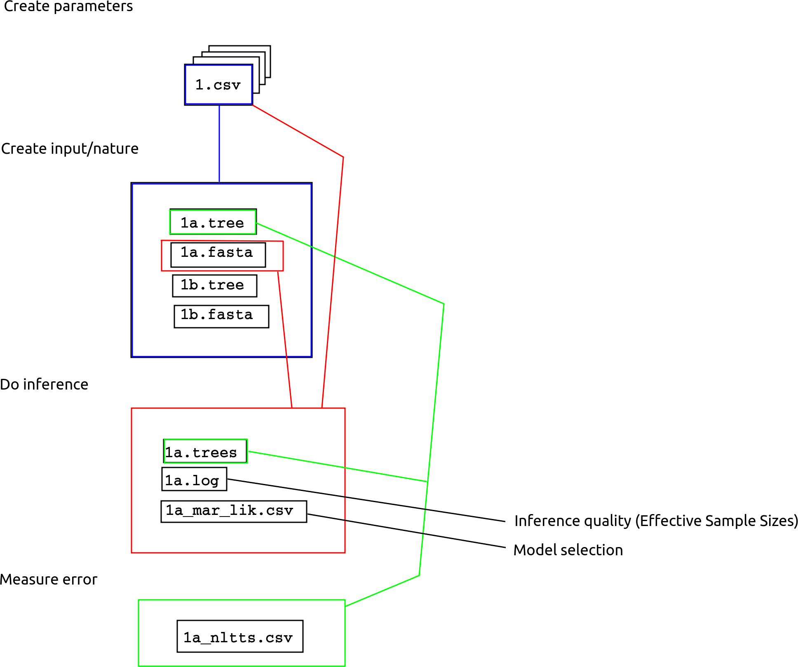

Legenda:
nLTT = normalized lineages through time;
BD = Birth Death Model;
MBD = Multiple Birth Death Model;

This is the pipeline to follow for the Razzo project. Our aim is to compare two nLTT distributions related to two tree posteriors: one descending from MBD alignments and another one from BD alignments. Both posteriors are generated using a BD prior in BEAST.

## Folder structure

In `razzo_project`, there is a folder called `data`.
In `data`, there are folders named after their parameters, e.g. `0.2-0.15-1-0.1`.
In each of these folders, there are folders named after their seeds, e.g. `1`.
In each of these folders, there are:

Filename|Description|Created by
-------------|---------------------------------------|--------------------------
`parameters.csv`|the parameter file|`raz_create_parameter_files`
`mbd.tree`|the true MBD tree|`raz_create_mbd_tree_file`
`mbd.fasta`|the true MBD alignment|`raz_create_mbd_alignment_file`
`bd.tree`|the twin BD tree|`raz_create_bd_tree_file`
`bd.fasta`|the twin BD alignment|`raz_create_bd_alignment_file`
`mbd.trees`|the posterior trees from `mbd.tree`|`raz_create_mbd_posterior_files`
`mbd.log`|the posterior parameter estimates from `mbd.tree`|`raz_create_mbd_posterior_files`
`mbd_mar_lik.csv`|the posterior's marginal likelihood from `mbd.tree`|`raz_create_mbd_posterior_files`
`bd.trees`|the posterior trees from `bd.tree`|`raz_create_bd_posterior_files`
`bd.log`|the posterior parameter estimates from `bd.tree`|`raz_create_bd_posterior_files`
`bd_mar_lik.csv`|the posterior's marginal likelihood from `bd.tree`|`raz_create_mb_posterior_files`
`mbd_nltts.csv`|the nLTT statistic distribution between `mbd.tree` and `mbd.trees`|`raz_create_mbd_nltt_file`
`bd_nltts.csv`|the nLTT statistic distribution between `bd.tree` and `bd.trees`|`raz_create_bd_nltt_file`

## Overview



Update our dependencies:

```{r message=FALSE}
devtools::install_github("Giappo/mbd", quiet = TRUE)
devtools::install_github("richelbilderbeek/beautier", quiet = TRUE)
devtools::install_github("richelbilderbeek/tracerer", quiet = TRUE)
devtools::install_github("richelbilderbeek/beastier", quiet = TRUE)
devtools::install_github("richelbilderbeek/mauricer", quiet = TRUE)
devtools::install_github("richelbilderbeek/babette", quiet = TRUE)
```

Load the libraries needed:

```{r}
library(razzo)
library(ggplot2)
```

We will work in this folder:

```{r}
super_folder_name <- tempdir()
project_folder_name <- file.path(super_folder_name, "razzo_project") 
dir.create(path = project_folder_name, recursive = TRUE)
```

## Step 1: Create parameter files

Here we create all parameter files:

```{r}
parameters_filenames <- raz_create_parameters_files(
  project_folder_name = project_folder_name
)
```

To speed things up, we'll be keeping only two parameter files:

```{r}
parameters_filenames <- parameters_filenames[c(1, 2)]
knitr::kable(parameters_filenames)
```

## Step 2: create MBD trees

```{r}
mbd_tree_filenames <- parameters_filenames
# Create all true trees, true alignments and their twins
for (i in seq_along(parameters_filenames)) {
  parameters_filename <- parameters_filenames[i]
  mbd_tree_filenames[i] <- raz_create_mbd_tree_file(parameters_filename)
}
```

Taking a look at the first MBD tree:

```{r}
ape::plot.phylo(ape::read.tree(file = mbd_tree_filenames[2]))
```

## Step 3: create twin BD trees

Then we want to generate a "twin" BD tree. 
To create such tree we have to estimate the best lambda and mu to make the comparison fair. 
To estimate the parameters we run a ML inference using the BD model.
We use "TESS::tess.sim.taxa.age" to generate the branching times (BD_brts). 
We also want to condition on the same amount of tips and on the survival of the phylogeny (cond = 2).
We then plug these branching times in the l_table coming from the original MBD tree to be sure that the topology is the same.

```{r}
bd_tree_filenames <- parameters_filenames
# Create all BD twin trees, true alignments and their twins
for (i in seq_along(parameters_filenames)) {
  parameters_filename <- parameters_filenames[i]
  bd_tree_filenames[i] <- raz_create_bd_tree_file(parameters_filename)
}
```

Taking a look at the first MBD tree:

```{r}
ape::plot.phylo(ape::read.tree(file = bd_tree_filenames[2]))
```

## Step 4: Create MBD alignments

```{r}
mbd_alignment_filenames <- parameters_filenames
# Create all true trees, true alignments and their twins
for (i in seq_along(parameters_filenames)) {
  parameters_filename <- parameters_filenames[i]
  mbd_alignment_filenames[i] <- raz_create_mbd_alignment_file(parameters_filename)
}
```

Taking a look at the first MBD alignment:

```{r}
image(ape::read.FASTA(file = mbd_alignment_filenames[1]))
```

## Step 5: Create BD alignments

```{r}
bd_alignment_filenames <- parameters_filenames
# Create all true trees, true alignments and their twins
for (i in seq_along(parameters_filenames)) {
  parameters_filename <- parameters_filenames[i]
  bd_alignment_filenames[i] <- raz_create_bd_alignment_file(parameters_filename)
}
```

Taking a look at the first MBD alignment:

```{r}
image(ape::read.FASTA(file = bd_alignment_filenames[1]))
```

## Step 6: create MBD posterior files

The next step is to use the package "pirouette" to generate, from the MBD tree, 
first the alignments and then, through BEAST, 
a posterior distribution of trees. 
These trees are obtained using a BD prior. 
This means that there are no simultaneous branching events.

```{r}
mbd_alignment_filenames <- list()
for (i in seq_along(parameters_filenames)) {

  if (rappdirs::app_dir()$os != "win") {
    # Do the inference
    mbd_alignment_filenames[[i]] <- raz_create_mbd_posterior_files(
      parameters_filenames[i]
    )
  } else {
    # Use fakes, Nested Sampling does not work under Windows
    mbd_alignment_filenames[[i]] <- c(
      raz_get_path("mbd.trees"),
      raz_get_path("mbd.log"),
      raz_get_path("mbd_mar_log_lik.csv")
    )
  }
  # Posterior trees
  testit::assert(any(stringr::str_detect(mbd_alignment_filenames[[i]], ".*/mbd\\.trees")))
  # Trace of MCMC, to estimate the Effective Sample Sizes
  testit::assert(any(stringr::str_detect(mbd_alignment_filenames[[i]], ".*/mbd\\.log")))
  # Marginal likelihood
  testit::assert(any(stringr::str_detect(mbd_alignment_filenames[[i]], ".*/mbd_mar_log_lik\\.csv")))
}
```

Plot the densitree:

```{r}
babette::plot_densitree(ape::read.tree(mbd_alignment_filenames[[1]][1]))
```

Plot the Effective Sample Sizes (must be at least 200 in manuscript):

```{r}
knitr::kable(
  tracerer::calc_esses(
    # -1 to drop first column
    utils::read.csv(mbd_alignment_filenames[[1]][2])[-1], 
    sample_interval = raz_open_parameters_file(
      parameters_filename[1]
    )$sample_interval
  )
)
```


## Step 7: create BD posterior files

We repeat the same process for the tree simulated according to the BD model. 
We want to have, in principle, the same amount of substitutions; 
to do so we modify the mutation rate according to the ratio 
of the total branch lenghts of the trees simulated with the two models.

```{r}
bd_alignment_filenames <- list()
for (i in seq_along(parameters_filenames)) {

  if (rappdirs::app_dir()$os != "win") {
    # Do the inference
    bd_alignment_filenames[[i]] <- raz_create_bd_posterior_files(
      parameters_filenames[i]
    )
  } else {
    # Use fakes, Nested Sampling does not work under Windows
    bd_alignment_filenames[[i]] <- c(
      raz_get_path("bd.trees"),
      raz_get_path("bd.log"),
      raz_get_path("bd_mar_log_lik.csv")
    )
  }
  # Posterior trees
  testit::assert(any(stringr::str_detect(bd_alignment_filenames[[i]], ".*/bd\\.trees")))
  # Trace of MCMC, to estimate the Effective Sample Sizes
  testit::assert(any(stringr::str_detect(bd_alignment_filenames[[i]], ".*/bd\\.log")))
  # Marginal likelihood
  testit::assert(any(stringr::str_detect(bd_alignment_filenames[[i]], ".*/bd_mar_log_lik\\.csv")))
}
```

Plot the densitree:

```{r}
babette::plot_densitree(ape::read.tree(bd_alignment_filenames[[1]][1]))
```

Plot the Effective Sample Sizes (must be at least 200 in manuscript):

```{r}
knitr::kable(
  tracerer::calc_esses(
    # -1 to drop first column
    utils::read.csv(bd_alignment_filenames[[1]][2])[-1], 
    sample_interval = raz_open_parameters_file(
      parameters_filename[1]
    )$sample_interval
  )
)
```

## step 8: calculate nLTT statistics for MBD

Finally we calculate the nLTT statistics for the MBD posteriors 
related to the original trees.

```{r}
if (rappdirs::app_dir()$os != "win") {
  mbd_nltt_filenames <- rep(NA, length(parameters_filenames))
  for (i in seq_along(parameters_filenames)) {
    mbd_nltt_filenames[i] <- raz_create_mbd_nltts_file(
      parameters_filenames[i]
    )
  }
}
```

```{r}
if (rappdirs::app_dir()$os != "win") {
  ggplot(
    data = data.frame(nltt = utils::read.csv(mbd_nltt_filenames[1])$x),
    aes(x = nltt)
  ) + geom_histogram(binwidth = 0.01) + 
    ggplot2::scale_x_continuous(limits = c(0.0, 1.0))
}
```


## step 9: calculate nLTT statistics for BD

Finally we calculate the nLTT statistics for the BD posteriors 
related to the original trees.

```{r}
if (rappdirs::app_dir()$os != "win") {
  bd_nltt_filenames <- rep(NA, length(parameters_filenames))
  for (i in seq_along(parameters_filenames)) {
    bd_nltt_filenames[i] <- raz_create_bd_nltts_file(
      parameters_filenames[i]
    )
  }
}
```

```{r}
if (rappdirs::app_dir()$os != "win") {
  ggplot(
    data = data.frame(nltt = utils::read.csv(bd_nltt_filenames[1])$x),
    aes(x = nltt)
  ) + geom_histogram(binwidth = 0.01) + 
    ggplot2::scale_x_continuous(limits = c(0.0, 1.0))
}
```

## Step 10: measure Effective Sample Sizes

We already had a sneak-peek at the ESSes.
In this step, we measure the ESSes of all files and
combine it into one file:

```{r}
if (1 == 2) {
  esses_filename <- raz_create_esses_file(parameters_filenames)
  knitr::kable(utils::read.csv(esses_filename)[-1])
}
```

## Step 11: compare marginal likelihoods

For each biological parameter setting, 
we use two site models and two clock models in our inference.
Although we know the generative model follows a 
Jukes-Cantor site model and a strict clock model, 
does this also show when using the Bayes factor?


```{r}
# Do after #65
if (1 == 2) {
  marg_log_lik_filename <- raz_create_marg_log_lik_file(parameters_filenames)
  knitr::kable(utils::read.csv(marg_log_lik_filename)[-1])
}
```


## Step 12: what is the effect of MBD on the error?

The nLTT statistics of the BD tree shows the baseline error:
the Bayesian analysis assumes BD, and that tree *is* BD.

```{r}
if (rappdirs::app_dir()$os != "win") {
  mbd_nltts <- utils::read.csv(mbd_nltt_filenames[1])$x
  bd_nltts <- utils::read.csv(bd_nltt_filenames[1])$x
  
  df <- data.frame(
    model = c(rep("MBD", length(mbd_nltts)), rep("BD", length(bd_nltts))),
    nltt = c(mbd_nltts, bd_nltts),
    stringsAsFactors = TRUE  
  )
  
  plot <- ggplot(
    data = df,
    aes(x = nltt, fill = model)
  ) + ggplot2::scale_x_continuous(limits = c(0.0, 1.0))
  
  plot + geom_histogram(binwidth = 0.01, alpha = 0.5)
  plot + geom_density(alpha = 0.5)
}
```
